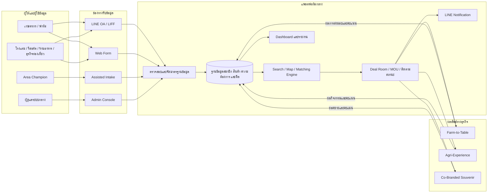
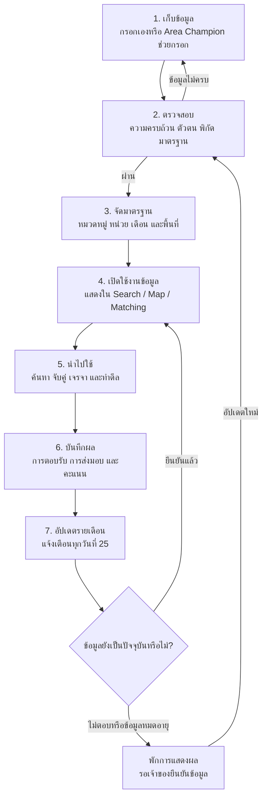
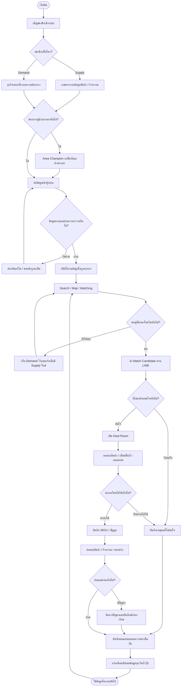

# คำอธิบายระบบเครือข่ายธุรกิจเกษตร–ปศุสัตว์และการท่องเที่ยว

> เอกสารอธิบายภาพรวมธุรกิจ รูปแบบการเก็บและใช้ข้อมูล การเชื่อมโยงพันธมิตร และ Workflow ของแพลตฟอร์ม

## 1. สรุปโครงการในประโยคเดียว

โครงการนี้คือ **แพลตฟอร์ม B2B Matching และระบบบริหารเครือข่ายภาคสนาม** ที่เชื่อมเกษตรกรหรือฟาร์มซึ่งมีสินค้าและกิจกรรม เข้ากับโรงแรม รีสอร์ต ร้านอาหาร และธุรกิจท่องเที่ยวที่ต้องการซื้อสินค้า สร้างแพ็กเกจ หรือจำหน่ายของฝากร่วมกัน

ระบบไม่ได้ทำหน้าที่เป็นเพียง “ตลาดออนไลน์” แต่ทำหน้าที่ 4 อย่างพร้อมกัน:

1. รวบรวมและรักษาฐานข้อมูลทรัพยากรของเครือข่ายทั่วประเทศ
2. ทำให้ผู้ซื้อค้นพบผู้ผลิตที่เหมาะสมในพื้นที่ใกล้เคียง
3. สนับสนุนให้ทั้งสองฝ่ายเจรจาและสร้างข้อตกลงธุรกิจร่วมกัน
4. เก็บผลการทำงานกลับมาเพิ่มความน่าเชื่อถือและคุณภาพของการจับคู่ครั้งต่อไป

## 2. ปัญหาที่โครงการต้องการแก้

### ฝั่งเกษตรกรและฟาร์ม

- ผลผลิตมีตามรอบและฤดูกาล แต่ไม่มีตลาดรับซื้อที่สม่ำเสมอ
- เข้าถึงโรงแรม ร้านอาหาร และธุรกิจท่องเที่ยวโดยตรงได้ยาก
- ข้อมูลกำลังผลิต ราคา มาตรฐาน และการจัดส่งกระจัดกระจาย
- เกษตรกรบางรายไม่สะดวกกรอกข้อมูลดิจิทัลด้วยตนเอง

### ฝั่งธุรกิจท่องเที่ยว

- หาผู้ผลิตท้องถิ่นที่ไว้ใจได้และส่งสินค้าได้ต่อเนื่องยาก
- ไม่ทราบว่าฟาร์มใดมีสินค้า กิจกรรม หรือมาตรฐานตรงกับความต้องการ
- ต้องใช้เวลาเจรจาและตรวจสอบพันธมิตรแต่ละรายเอง
- ต้องการสินค้าและเรื่องราวท้องถิ่นเพื่อเพิ่มมูลค่าให้ประสบการณ์ของลูกค้า

### ฝั่งเครือข่ายหรือผู้บริหารโครงการ

- ไม่มีฐานข้อมูลกลางที่มองเห็น Supply และ Demand รายพื้นที่
- ไม่สามารถติดตามจำนวนสมาชิก คุณภาพข้อมูล โอกาสจับคู่ และผลลัพธ์ของดีลได้อย่างเป็นระบบ
- วางแผนพัฒนาคลัสเตอร์เศรษฐกิจในแต่ละภูมิภาคได้ยาก

## 3. ผู้มีส่วนร่วมในระบบ

| กลุ่ม | บทบาท | ข้อมูลที่ให้ระบบ | สิ่งที่ได้รับจากระบบ |
|---|---|---|---|
| เกษตรกรและฟาร์ม | ผู้ขายสินค้าและเจ้าของกิจกรรม | โปรไฟล์ฟาร์ม พิกัด สินค้า กำลังผลิต ราคา ฤดูกาล การจัดส่ง มาตรฐาน และกิจกรรม | ช่องทางขาย คู่ค้าธุรกิจ และโอกาสสร้างรายได้ใหม่ |
| ธุรกิจท่องเที่ยว | ผู้ซื้อ ผู้จัดแพ็กเกจ หรือช่องทางจำหน่าย | โปรไฟล์ธุรกิจ ความต้องการซื้อ ปริมาณ รอบส่ง งบ มาตรฐาน และกลุ่มลูกค้า | ผู้ผลิตใกล้พื้นที่ วัตถุดิบ กิจกรรม และของฝากที่ตรงความต้องการ |
| Area Champion | ผู้ประสานงานประจำพื้นที่ | ข้อมูลจากการลงพื้นที่ ผลการตรวจสอบ และสถานะสมาชิก | เครื่องมือช่วยกรอก แดชบอร์ด และรายงานผลการจับคู่ในพื้นที่ |
| ผู้ดูแลระบบกลาง | กำกับคุณภาพข้อมูลและกระบวนการ | หมวดหมู่ มาตรฐาน สิทธิ์ผู้ใช้ กฎจับคู่ และผลตรวจสอบ | ภาพรวมเครือข่าย รายงาน และข้อมูลสำหรับตัดสินใจ |
| นักท่องเที่ยว | ผู้ใช้ปลายทางโดยอ้อม | รีวิวหรือความพึงพอใจ หากมีการเก็บในอนาคต | อาหารท้องถิ่น กิจกรรม และสินค้าที่มีเรื่องราว |

## 4. รูปแบบการเชื่อมโยงธุรกิจ

แพลตฟอร์มรองรับการสร้างธุรกิจร่วมกัน 3 รูปแบบ

### 4.1 Farm-to-Table

ฟาร์มขายวัตถุดิบสดให้โรงแรม รีสอร์ต หรือร้านอาหารเป็นรอบประจำ

**ตัวอย่าง:** ฟาร์มไข่ในระยะ 25 กิโลเมตร ส่งไข่ 3,000 ฟองให้โรงแรมทุกเดือน

ข้อมูลที่ใช้จับคู่:

- ประเภทและคุณลักษณะของสินค้า
- กำลังผลิตและเดือนที่พร้อมขาย
- ปริมาณที่ผู้ซื้อต้องการ
- ราคาขายส่งและงบประมาณ
- พิกัด ระยะส่ง และรูปแบบ Logistics
- มาตรฐานที่ผู้ซื้อต้องการ

ผลลัพธ์ทางธุรกิจ:

- เกษตรกรมีคำสั่งซื้อสม่ำเสมอ
- ธุรกิจท่องเที่ยวได้วัตถุดิบสดจากพื้นที่
- โรงแรมหรือร้านอาหารนำเรื่องราวของฟาร์มไปใช้สื่อสารกับลูกค้าได้

### 4.2 Agri-Experience and Tourism

ฟาร์มเปิดกิจกรรมและจับมือกับที่พักหรือบริษัททัวร์เพื่อขายเป็นแพ็กเกจ

**ตัวอย่าง:** รีสอร์ตขายแพ็กเกจที่พัก 2 วัน พร้อมกิจกรรมเก็บเมล่อนและทำขนมที่ฟาร์มใกล้เคียง

ข้อมูลที่ใช้จับคู่:

- ประเภทกิจกรรมและกลุ่มเป้าหมาย
- ความจุต่อรอบ ระยะเวลา และราคา
- วันและเวลาที่เปิดให้บริการ
- ระยะทางจากที่พัก
- ที่จอดรถ ห้องน้ำ จุดพัก และสิ่งอำนวยความสะดวก
- ความเหมาะสมกับครอบครัว นักเรียน หรือคณะทัวร์

ผลลัพธ์ทางธุรกิจ:

- ฟาร์มมีรายได้จากบริการ ไม่พึ่งการขายผลผลิตอย่างเดียว
- ที่พักสร้างแพ็กเกจที่แตกต่างจากคู่แข่ง
- นักท่องเที่ยวมีประสบการณ์เชื่อมโยงกับชุมชนจริง

### 4.3 Co-Branded Souvenir

ธุรกิจท่องเที่ยวนำสินค้าแปรรูปจากชุมชนมาขาย เป็น Welcome Gift หรือพัฒนาสินค้าร่วมกัน

**ตัวอย่าง:** รีสอร์ตใช้แยมผลไม้ของกลุ่มชุมชนเป็นของต้อนรับและวางขายที่ร้านของฝาก

ข้อมูลที่ใช้จับคู่:

- ประเภทสินค้าและเรื่องราวของผู้ผลิต
- จำนวนสินค้าพร้อมส่งต่อเดือน
- ราคาส่ง ราคาขายปลีก และ Margin
- อายุสินค้าและเงื่อนไขการเก็บรักษา
- มาตรฐาน เช่น อย. มผช. ฮาลาล หรือ OTOP
- ความสามารถในการทำฉลากหรือแบรนด์ร่วม

ผลลัพธ์ทางธุรกิจ:

- ผู้ผลิตมีช่องทางจำหน่ายใหม่
- ที่พักมีรายได้เสริมและสร้าง Brand Experience
- รายได้หมุนเวียนอยู่ในชุมชนมากขึ้น

## 5. ภาพรวมสถาปัตยกรรมระบบ

## 6. รูปแบบการเก็บข้อมูล

### 6.1 ช่องทางการเก็บข้อมูล

#### กรอกด้วยตนเอง

เกษตรกรหรือผู้ประกอบการเปิดแบบฟอร์มผ่าน LINE OA, LIFF หรือเว็บบนโทรศัพท์ แล้วกรอกข้อมูลและอัปโหลดภาพ

เหมาะกับผู้ใช้ที่ใช้งานสมาร์ตโฟนได้และต้องการแก้ไขข้อมูลของตนเองภายหลัง

#### Area Champion ช่วยกรอก

ตัวแทนพื้นที่ลงสัมภาษณ์สมาชิก ปักพิกัด ถ่ายภาพ และคีย์ข้อมูลแทน โดย Blueprint ตั้งเป้าว่าหนึ่งคนช่วยเก็บได้ประมาณ 20–30 ฟาร์มต่อวัน

รูปแบบนี้ช่วยลด Digital Barrier แต่ต้องมีระบบบันทึกว่าใครเป็นผู้กรอก ใครเป็นเจ้าของข้อมูล และใครเป็นผู้ตรวจสอบ

#### ผู้ดูแลระบบตรวจและแก้ไข

ผู้ดูแลตรวจความครบถ้วน แก้หมวดหมู่ รวมรายการซ้ำ และเปลี่ยนสถานะข้อมูลก่อนนำไปแสดงหรือจับคู่

### 6.2 กลุ่มข้อมูลหลักที่ต้องเก็บ

#### A. ข้อมูลสมาชิกและสถานที่

Blueprint ระบุบทบาทและพิกัดไว้แล้ว แต่การพัฒนาระบบจริงควรมีข้อมูลพื้นฐานดังนี้:

- รหัสสมาชิกและประเภทสมาชิก
- ชื่อบุคคล ชื่อฟาร์ม หรือชื่อธุรกิจ
- ผู้ติดต่อ เบอร์โทร และ LINE
- ที่อยู่ จังหวัด อำเภอ ตำบล และพิกัด GPS
- บทบาทในระบบและ Area Champion ที่ดูแล
- สถานะการยินยอมให้ใช้ข้อมูล
- สถานะการตรวจสอบและวันที่อัปเดตล่าสุด

#### B. ตะกร้าที่ 1: ผลผลิตสดรายเดือน

- ชื่อและหมวดหมู่ผลผลิต
- กำลังผลิตเฉลี่ยต่อเดือนและหน่วยนับ
- ช่วงเดือนที่มีผลผลิต
- ปริมาณที่พร้อมขาย
- ราคาขายส่ง B2B
- วิธีส่งมอบและรัศมีจัดส่ง
- ความสามารถด้าน Cold Chain
- มาตรฐานรับรองและวันหมดอายุของใบรับรอง
- ภาพสินค้าและสถานที่ผลิต

#### C. ตะกร้าที่ 2: สินค้าแปรรูปและของฝาก

- ชื่อสินค้าและประเภทสินค้า
- จำนวนสต็อกพร้อมส่งต่อเดือน
- ราคาส่ง ราคาขายปลีกแนะนำ และ Margin
- อายุสินค้าและวิธีเก็บรักษา
- ขนาดบรรจุและจำนวนขั้นต่ำในการสั่ง
- มาตรฐาน อย. มผช. ฮาลาล หรือ OTOP
- ความพร้อมทำ Private Label หรือ Co-brand

#### D. ตะกร้าที่ 3: กิจกรรมและบริการท่องเที่ยว

- ชื่อและรายละเอียดกิจกรรม
- กลุ่มลูกค้าที่เหมาะสม
- ความจุสูงสุดต่อรอบ
- ระยะเวลาและค่าบริการ
- วันและเวลาที่เปิดให้บริการ
- สิ่งอำนวยความสะดวก
- ข้อจำกัดด้านอายุ สุขภาพ หรือสภาพอากาศ
- รูปภาพและเงื่อนไขการจองหรือยกเลิก

#### E. ข้อมูลความต้องการซื้อ

Blueprint เดิมให้รายละเอียดฝั่ง Supply มากกว่าฝั่ง Demand ดังนั้นส่วนนี้เป็น **ข้อมูลที่จำเป็นต้องเพิ่มก่อนสร้างระบบจริง**:

- ผู้ซื้อต้องการสินค้า กิจกรรม หรือของฝากประเภทใด
- ปริมาณและหน่วยที่ต้องการ
- ความถี่และวันที่ต้องการรับ
- งบประมาณหรือช่วงราคาที่รับได้
- มาตรฐานขั้นต่ำ
- รัศมีหรือพื้นที่ที่รับสินค้าได้
- วิธีส่งมอบที่รองรับ
- ระยะเวลาของสัญญาหรือช่วงทดลอง
- ผู้มีอำนาจอนุมัติและข้อมูลติดต่อ

#### F. ข้อมูลการจับคู่และดีล

ส่วนนี้ยังไม่ได้ลงรายละเอียดใน Blueprint แต่จำเป็นสำหรับติดตามผล:

- ผู้ซื้อและผู้ขายที่ถูกจับคู่
- เหตุผลหรือเงื่อนไขที่ระบบใช้จับคู่
- วันที่แนะนำคู่ค้าและผู้รับผิดชอบ
- สถานะดีล เช่น แนะนำแล้ว ติดต่อแล้ว ทดลองส่ง เจรจา สำเร็จ หรือไม่สำเร็จ
- ราคา ปริมาณ รอบส่ง และเงื่อนไขที่ตกลงจริง
- เอกสาร MOU หรือสัญญา
- ปัญหาการส่งมอบและการแก้ไข
- คะแนนและความคิดเห็นหลังจบรายการ

## 7. วงจรชีวิตของข้อมูล

ข้อมูลในระบบไม่ควรถูกเก็บครั้งเดียวแล้วใช้ตลอดไป เพราะกำลังผลิต ราคา สต็อก และฤดูกาลเปลี่ยนแปลงเสมอ

### สถานะข้อมูลที่แนะนำ

สถานะต่อไปนี้เป็นข้อเสนอเพื่อให้ทีมพัฒนาสามารถควบคุมคุณภาพข้อมูลได้:

- **Draft:** กรอกยังไม่ครบ
- **Pending Verification:** รอตรวจสอบ
- **Active:** ตรวจแล้วและใช้จับคู่ได้
- **Needs Update:** ถึงรอบยืนยันข้อมูล
- **Stale:** ไม่ได้รับการยืนยันตามระยะเวลาที่กำหนด
- **Suspended:** ถูกพักเนื่องจากปัญหาคุณภาพหรือข้อร้องเรียน
- **Archived:** เลิกกิจการหรือไม่ใช้ระบบแล้ว

## 8. การนำข้อมูลมาใช้งาน

### 8.1 ค้นหาและแสดงผลบนแผนที่

ผู้ซื้อสามารถค้นหาฟาร์มตามพื้นที่ ประเภทสินค้า ฤดูกาล ราคา มาตรฐาน และรัศมีการจัดส่ง โดยแผนที่ช่วยให้เห็นความหนาแน่นของ Supply และระยะทางระหว่างคู่ค้า

### 8.2 จับคู่ Supply กับ Demand

Matching Engine ไม่ควรจับคู่จากระยะทางเพียงอย่างเดียว แต่ควรทำงาน 2 ชั้น

#### ชั้นที่ 1: เงื่อนไขบังคับ

- รายการต้องอยู่ในสถานะ Active
- ประเภทสินค้า บริการ หรือกิจกรรมต้องตรงกัน
- มีของหรือมีคิวในช่วงเวลาที่ต้องการ
- ปริมาณขั้นต่ำและกำลังผลิตต้องรองรับ
- อยู่ในรัศมีจัดส่งหรือเดินทางที่ยอมรับได้
- มีมาตรฐานขั้นต่ำตามที่ผู้ซื้อกำหนด

หากไม่ผ่านเงื่อนไขบังคับ ระบบไม่ควรแนะนำเป็นคู่หลัก

#### ชั้นที่ 2: จัดลำดับความเหมาะสม

- ระยะทางใกล้กว่า
- ปริมาณครอบคลุม Demand ได้มากกว่า
- เงื่อนไข Logistics ตรงกัน
- ข้อมูลได้รับการอัปเดตล่าสุด
- มีประวัติส่งมอบตรงเวลา
- มีคะแนนความน่าเชื่อถือสูง
- อยู่ในคลัสเตอร์หรือเครือข่ายที่เกี่ยวข้อง

Blueprint ยังไม่ได้กำหนดน้ำหนักคะแนน ดังนั้นระบบระยะแรกควรแสดงเหตุผลที่จับคู่และให้ผู้ดูแลช่วยคัดเลือก แทนการตัดสินใจอัตโนมัติทั้งหมด

### 8.3 สร้างข้อเสนอธุรกิจ

ข้อมูลของทั้งสองฝ่ายถูกนำมาสร้าง Match Card หรือ Opportunity Brief ซึ่งควรสรุป:

- ใครต้องการซื้ออะไรจากใคร
- ปริมาณ ราคา และช่วงเวลา
- ระยะทางและรูปแบบส่งมอบ
- มาตรฐานและความเสี่ยงที่ต้องตรวจเพิ่ม
- ผู้ประสานงานและขั้นตอนถัดไป

### 8.4 สนับสนุนการเจรจาและทำข้อตกลง

เมื่อทั้งสองฝ่ายสนใจ ระบบเปิด Deal Room สำหรับบันทึกการติดต่อ เงื่อนไข การทดลองส่งสินค้า และ MOU

คำว่า Deal Room ใน Blueprint ควรเข้าใจว่าเป็น “พื้นที่บริหารโอกาสธุรกิจ” ไม่ได้หมายความว่าระบบต้องรับชำระเงินตั้งแต่เวอร์ชันแรก

### 8.5 สร้าง Dashboard และข้อมูลตัดสินใจ

ข้อมูลที่เก็บสามารถนำไปใช้ตอบคำถาม เช่น:

- จังหวัดใดมีสินค้าอะไรและมีปริมาณเท่าไร
- พื้นที่ใดมี Demand มากกว่า Supply
- สินค้าหรือกิจกรรมใดมีโอกาสจับคู่สูง
- Area Champion คนใดเก็บข้อมูลและสร้างดีลได้เท่าไร
- คู่ค้ารายใดส่งมอบได้สม่ำเสมอ
- ดีลหยุดอยู่ที่ขั้นตอนไหนและเพราะเหตุใด

## 9. Workflow การทำงานแบบ End-to-End

### Phase 1: Smart Onboarding

1. เครือข่ายเชิญเกษตรกร ฟาร์ม และธุรกิจท่องเที่ยวเข้าระบบ
2. สมาชิกเลือกบทบาทและกรอกข้อมูลผ่าน LINE OA, LIFF หรือ Web Form
3. หากกรอกเองไม่สะดวก Area Champion ช่วยเก็บข้อมูลภาคสนาม
4. ระบบบันทึกผู้กรอก เจ้าของข้อมูล เวลา และพิกัด

**ผลลัพธ์:** ได้โปรไฟล์สมาชิกและรายการสินค้า ความต้องการ หรือกิจกรรมฉบับร่าง

### Phase 2: Data Structuring and Verification

1. ระบบตรวจช่องบังคับ รูปแบบเบอร์โทร พิกัด และหน่วยนับ
2. ผู้ดูแลหรือ Area Champion ตรวจตัวตน รูปภาพ และใบรับรอง
3. ระบบจัดหมวดหมู่สินค้า เดือนที่พร้อม และพื้นที่ให้เป็นมาตรฐานเดียวกัน
4. รายการที่ผ่านการตรวจถูกเปลี่ยนเป็น Active

**ผลลัพธ์:** ข้อมูลพร้อมค้นหาและนำไปจับคู่

### Phase 3: Search and Smart Matching

1. ผู้ซื้อสร้าง Demand หรือค้นหารายการด้วยตนเอง
2. ระบบกรองผู้ผลิตตามประเภท ช่วงเวลา ปริมาณ มาตรฐาน และรัศมี
3. ระบบเรียงลำดับคู่ค้าที่เหมาะสมและแสดงเหตุผล
4. ผู้ดูแลหรือ Area Champion ตรวจรายชื่อก่อนส่งคำแนะนำ
5. ทั้งสองฝ่ายได้รับการแจ้งเตือนผ่าน LINE

**ผลลัพธ์:** เกิด Match Candidate หรือโอกาสธุรกิจ ยังไม่ถือว่าเป็นดีลสำเร็จ

### Phase 4: Deal Room and Agreement

1. คู่ค้าแสดงความสนใจและเปิดการติดต่อ
2. ตกลงตัวอย่างสินค้า การเข้าชมฟาร์ม หรือการทดลองส่ง
3. เจรจาราคา ปริมาณ รอบส่ง คุณภาพ การชำระเงิน และผู้รับผิดชอบ
4. บันทึกข้อตกลงใน MOU หรือสัญญา
5. เปลี่ยนสถานะดีลตามความคืบหน้า

**ผลลัพธ์:** ได้ข้อตกลงธุรกิจที่มีเงื่อนไขชัดเจน

### Phase 5: Fulfillment, Feedback and Monthly Sync

1. ผู้ขายส่งสินค้า ให้บริการกิจกรรม หรือส่งมอบของฝาก
2. ผู้ซื้อยืนยันปริมาณ คุณภาพ และการส่งมอบ
3. ระบบบันทึกผล ปัญหา และคะแนนความน่าเชื่อถือ
4. ทุกวันที่ 25 ระบบเตือนผู้ขายให้อัปเดตกำลังผลิต ราคา และสถานะเดือนถัดไป
5. ข้อมูลใหม่ถูกนำกลับไปใช้จับคู่รอบต่อไป

**ผลลัพธ์:** ระบบเรียนรู้จากผลจริงและลดการแนะนำข้อมูลที่ล้าสมัย

## 10. Workflow Diagram

## 11. ตัวอย่างการทำงานจริง

### กรณีโรงแรมต้องการไข่ไก่เดือนละ 5,000 ฟอง

1. โรงแรมสร้าง Demand ระบุไข่ไก่ 5,000 ฟองต่อเดือน ส่งทุกสัปดาห์ ต้องอยู่ไม่เกิน 40 กิโลเมตร
2. ระบบค้นหาฟาร์มไข่ที่ Active มีปริมาณรองรับ และส่งในรัศมีดังกล่าว
3. พบฟาร์ม A รองรับ 3,000 ฟอง และฟาร์ม B รองรับ 2,500 ฟอง
4. ระบบสามารถเสนอการจับคู่แบบหลายผู้ขายเพื่อให้ครบ Demand
5. Area Champion ตรวจสอบข้อมูลล่าสุดและประสานให้โรงแรมทดลองรับสินค้า
6. ทั้งสองฝ่ายตกลงราคา รอบส่ง เงื่อนไขคุณภาพ และการชำระเงิน
7. หลังส่งจริง โรงแรมยืนยันปริมาณและให้คะแนนการตรงเวลา
8. วันที่ 25 ฟาร์มยืนยันกำลังผลิตเดือนถัดไป ระบบจึงใช้ข้อมูลใหม่วางแผนรอบต่อไป

ตัวอย่างนี้แสดงว่า Matching ไม่จำเป็นต้องเป็นหนึ่งผู้ซื้อกับหนึ่งผู้ขายเสมอไป แต่สามารถรวม Supply หลายรายเพื่อเติม Demand เดียวได้ หากระบบกำหนดกฎและความรับผิดชอบชัดเจน

## 12. โมดูลของระบบ

### โมดูลที่ Blueprint ระบุไว้

- LINE OA / LIFF และ Web Form
- Assisted Intake สำหรับ Area Champion
- การจัดมาตรฐานและตรวจสอบข้อมูล
- ฐานข้อมูลสินค้า 3 ตะกร้า
- Interactive Matching Map และ Search
- Smart Matching Engine
- Deal Room และ MOU Template
- LINE Notification
- Monthly Sync ทุกวันที่ 25
- Rating และ Dashboard ระดับพื้นที่

### โมดูลที่ควรเพิ่มเพื่อให้ระบบทำงานจริง

- Identity, Authentication และ Role-based Permission
- Demand Management
- Data Consent และ PDPA
- Verification Queue และ Audit Log
- Deal Pipeline และผู้รับผิดชอบแต่ละขั้น
- Contract และ Document Management
- Issue, Dispute และ Complaint Management
- Logistics และ Delivery Record
- Reporting, KPI และ Data Export

ระบบชำระเงิน การจอง และ Escrow อาจเพิ่มภายหลังเมื่อพิสูจน์รูปแบบธุรกิจแล้ว ไม่จำเป็นต้องอยู่ใน MVP แรก

## 13. Dashboard และตัวชี้วัด

### ตัวชี้วัดด้านฐานข้อมูล

- จำนวนสมาชิกที่ Active แยกตามจังหวัดและบทบาท
- อัตราข้อมูลที่ผ่านการตรวจสอบ
- อัตราข้อมูลที่ได้รับการอัปเดตภายในรอบ
- จำนวน Supply, Demand และกิจกรรมที่ใช้งานได้

### ตัวชี้วัดด้านการจับคู่

- จำนวน Match Candidate
- อัตราการตอบรับคำแนะนำ
- อัตราเปลี่ยนจาก Match เป็นการทดลองส่ง
- อัตราเปลี่ยนจากการทดลองเป็นข้อตกลง
- ระยะเวลาเฉลี่ยตั้งแต่แนะนำจนเกิดดีล

### ตัวชี้วัดด้านผลลัพธ์ธุรกิจ

- มูลค่าดีลและปริมาณการซื้อขาย
- จำนวนดีลที่ซื้อซ้ำ
- รายได้ใหม่ของสมาชิก
- อัตราส่งมอบตรงเวลา
- จำนวนข้อร้องเรียนและเวลาแก้ไข
- สัดส่วนเงินที่หมุนเวียนภายในพื้นที่

## 14. ข้อจำกัดและประเด็นที่ต้องตัดสินใจก่อนพัฒนา

Blueprint ปัจจุบันอธิบายวิสัยทัศน์และทิศทางได้ดี แต่ยังไม่ใช่ Technical Specification ที่ทีมพัฒนาสามารถสร้างระบบทั้งหมดได้ทันที ประเด็นที่ยังต้องตัดสินใจประกอบด้วย:

1. ใครเป็นเจ้าของและผู้กำกับข้อมูล
2. ใครเป็นผู้ตรวจสอบผู้ผลิตและมาตรฐาน
3. Area Champion ได้ค่าตอบแทนหรือแรงจูงใจอย่างไร
4. เจ้าของแพลตฟอร์มหารายได้จาก Commission, Subscription หรือบริการใด
5. การชำระเงินเกิดในระบบหรือนอกระบบ
6. ใครรับผิดชอบ Logistics, Cold Chain และสินค้าที่เสียหาย
7. ข้อพิพาท การคืนเงิน และการยกเลิกดีลจัดการอย่างไร
8. กฎ Matching และน้ำหนักคะแนนเป็นเท่าใด
9. ข้อมูลใดเปิดเผยต่อสาธารณะและข้อมูลใดเห็นเฉพาะสมาชิก
10. พื้นที่ สินค้า และกลุ่มผู้ซื้อสำหรับ Pilot คืออะไร

คำว่า **Guaranteed Monthly Demand** ควรใช้ด้วยความระมัดระวัง ระบบสามารถช่วยสร้างและติดตาม Demand ได้ แต่ไม่สามารถรับประกันยอดซื้อได้หากยังไม่มีสัญญาผูกพันหรือผู้รับความเสี่ยงที่ชัดเจน

## 15. ขอบเขต MVP ที่เหมาะสม

MVP ควรพิสูจน์ว่าเครือข่ายสร้างดีลจริงได้ ก่อนลงทุนสร้างระบบอัตโนมัติขนาดใหญ่

1. เลือก 1 จังหวัดหรือ 1 คลัสเตอร์
2. เลือกสินค้า 2–3 หมวดที่มี Demand ชัด
3. สร้าง Supply Form และ Demand Form
4. ให้ผู้ดูแลตรวจข้อมูลก่อนเผยแพร่
5. ทำหน้าค้นหาและกรองรายการแบบง่าย
6. ให้ทีมและ Area Champion จับคู่แบบ Curated Matching
7. ใช้ LINE แจ้งคู่ค้าและติดตามสถานะ
8. บันทึกผลดีล ปัญหา และเหตุผลที่จับคู่ไม่สำเร็จ
9. เพิ่ม Monthly Sync และ Reliability Score หลังมีข้อมูลจริง
10. ค่อยเพิ่มแผนที่ Smart Matching และ Deal Room เต็มรูปแบบ

## 16. สรุปความสัมพันธ์ทั้งหมด

โครงการนี้ขับเคลื่อนด้วยวงจรต่อไปนี้:

> **เครือข่ายสร้างข้อมูล → ข้อมูลทำให้เห็นโอกาส → ระบบช่วยจับคู่ → คนสร้างข้อตกลง → ธุรกิจส่งมอบคุณค่า → ผลลัพธ์ย้อนกลับมาทำให้ข้อมูลน่าเชื่อถือขึ้น**

ความสำเร็จของโครงการจึงไม่ได้วัดจากจำนวนสมาชิกหรือจำนวนข้อมูลเพียงอย่างเดียว แต่ต้องวัดจากจำนวนความร่วมมือที่เกิดขึ้นจริง การซื้อซ้ำ ความน่าเชื่อถือของคู่ค้า และรายได้ที่หมุนเวียนกลับสู่พื้นที่

---

## สถานะของเนื้อหาในเอกสารนี้

- ส่วนวิสัยทัศน์ โมเดลธุรกิจ ผู้ใช้งาน ตะกร้าข้อมูล Workflow 5 Phase และ Roadmap อ้างอิงจาก Blueprint ต้นฉบับ
- ส่วน Demand Data, Deal Data, Data Status, Matching Rules, KPI และรายละเอียด MVP เป็นคำอธิบายและข้อเสนอที่เติมให้ Blueprint สามารถนำไปกำหนด Requirement ได้
- โปรเจกต์ในโฟลเดอร์ปัจจุบันยังเป็นเอกสารแนวคิด ไม่มี Source Code, Database Schema หรือ Prototype ที่สร้างเสร็จแล้ว
